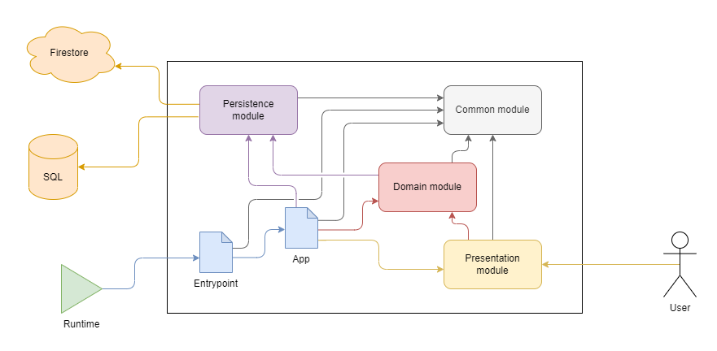

# STRV Assessment Project

This is an assessment project for STRV hiring process. It is a simple web application that allows users to create their own address book and add contacts to it.

URL of the application: **[https://strv-assignment-xmso23dwqa-lm.a.run.app](https://strv-assignment-xmso23dwqa-lm.a.run.app)**

API specification can be found at [https://strv-assignment-xmso23dwqa-lm.a.run.app/api-docs/](https://strv-assignment-xmso23dwqa-lm.a.run.app/api-docs/).

## Architecture

The application uses a classic three-tier architecture, with the influence of the DDD (Domain-Driven Design) approach. Most of the business logic is implemented in the domain layer, which is independent of the framework and the database.

The code is divided into four main modules. Three of them correspond to the three layers of the architecture, the fourth one is a shared module that contains common code for the other modules.

The architecture diagram is shown below:

The basic technologies used in the project are:
- **Express.js** as a web framework, significantly enhanced by:
  - `routing-controllers` library that allows to use decorators to define routes and controllers
  - `class-validator` and `class-transformer` libraries that allow to use decorators to validate and transform data
  - `class-validator-jsonschema`, `routing-controllers-openapi` and `swagger-ui-express` libraries that enable automatic generation of OpenAPI specification and UI with documentation
- **TypeDI** as a dependency injection container
- **TypeORM** as an database abstraction layer
- **PostgreSQL** as a production database, **SQLite** as a development database
- **Firestore Database** for storing data of users

## Codebase structure

The codebase is structured as follows:
- `src` - source code of the application
  - `api` - **presentation layer module**, contains API-related code
    - `controller` - API controllers
    - `middleware` - API middlewares
    - `dto` - definitions of API schemas
      - `request` - request schemas
      - `response` - response schemas
  - `common` - **shared module**, contains common code for the other modules
    - `error` - error classes
  - `data` - **persistence layer module**, contains database-related code
    - `db` - SQL database-related code
      - `entity` - database entities
      - `repository` - database repositories
    - `firebase` - Firestore-related code
      - `adapter` - adapter classes for manipulating Firestore data
      - `dto` - schema objects used for Firestore data operations
        - `action` - schema for input data of Firestore operations
        - `result` - schema for output data of Firestore operations
  - `logic` - **domain layer module**, contains business logic
    - `domain` - domain objects
    - `service` - domain services
- `test` - integration tests
  - The file structure is the same as in `src` directory.

Every one of the modules has its own `index.ts` file that exports all the public API of that module. Importing classes from the module by other modules only through `index.ts` file is enforced by the ESLint configuration.

## Getting started with local development

1. Ensure Node.js, Yarn and Java are installed on your machine and available in your `PATH`.
2. Clone the repository and install dependencies using `yarn install`.
3. Copy the `.env.local` file to `.env`. This will be your local environment configuration file, not tracked by Git.
4. Install [Firebase CLI](https://firebase.google.com/docs/cli#install_the_firebase_cli) and login using `firebase login`.
5. Generate [service account key](https://console.firebase.google.com/project/strv-assignment-365413/settings/serviceaccounts/adminsdk) for the Firebase project and save it to `firebase-credentials.json` file in the root directory of the project.
6. Run `yarn start:dev` to start the application in development mode. The application will be available at `http://localhost:3000`, automatically reloaded on code changes.

## Notes
- Everything that gets pushed to the `master` branch is automatically deployed to the production environment. Keep that in mind when making changes to the code.
- The application is hosted on Google Cloud Run platform. Since it is a serverless platform, the application is not always running. The first request to the application will take a few seconds to respond. Subsequent requests will be much faster.
- Code coverage is generated in the `coverage` folder every time the tests are run. The coverage report can be found in `coverage/index.html`.
